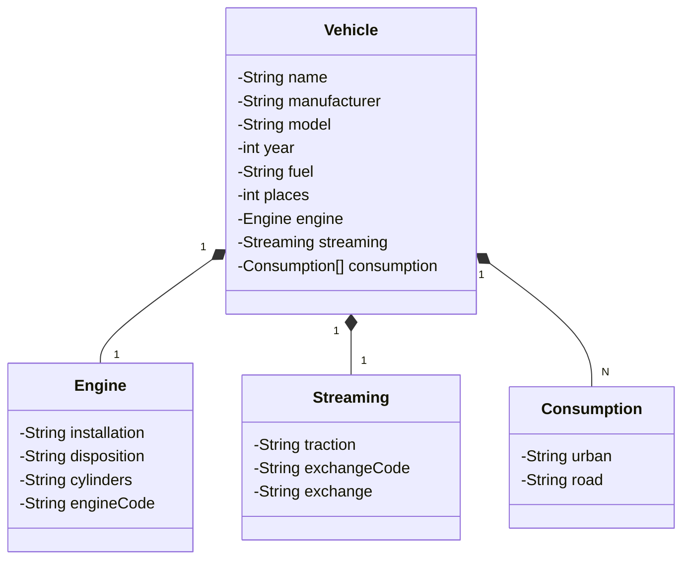

# Santander 2024 - Backend com java
Java RESTful criada para o Bootcamp da Santander na DIO

Deixe a seguinte frase mais chamativa, pode incluir novas idéias e corrigir sua gramática:
## Principais Tecnologias 
- **Java 17:** Desfrute de desempenho otimizado, escalabilidade incomparável e segurança reforçada ao utilizar a versão mais recente da linguagem Java, a escolha ideal para desenvolvedores exigentes;
- **Spring Boot 3:** Desfrute de desenvolvimento mais rápido e eficiente com a poderosa autoconfiguração do Spring Boot, liberando tempo para você se concentrar no que realmente importa **construir soluções inovadoras**;
- **Spring Data JPA:** Torne a integração com bancos de dados SQL mais rápida e fácil do que nunca com essa ferramenta inovadora, impulsionando sua produtividade e otimizando seu tempo;
- **OpenAPI (Swagger):** Crie documentações ricas em informações e valiosas que deliciam seus usuários e garantem que eles tirem o máximo proveito da sua API com OpenAPI e Spring Boot;
- **Railway:** facilita o deploy e monitoramento de nossas soluções na nuvem, além de oferecer diversos bancos de dados como serviço e pipelines de CI/CD.

## Diagrama de classes

## Documentação da API (Swagger)
- [Documentação Swagger](https://dio-api-rest-production.up.railway.app/swagger-ui/index.html#/)

API gratuita por tempo limitado no Railway. Código-fonte aberto para colaboração e inovação.

## 🔍 Referências
- [Digital Innovation One](https://github.com/digitalinnovationone)
