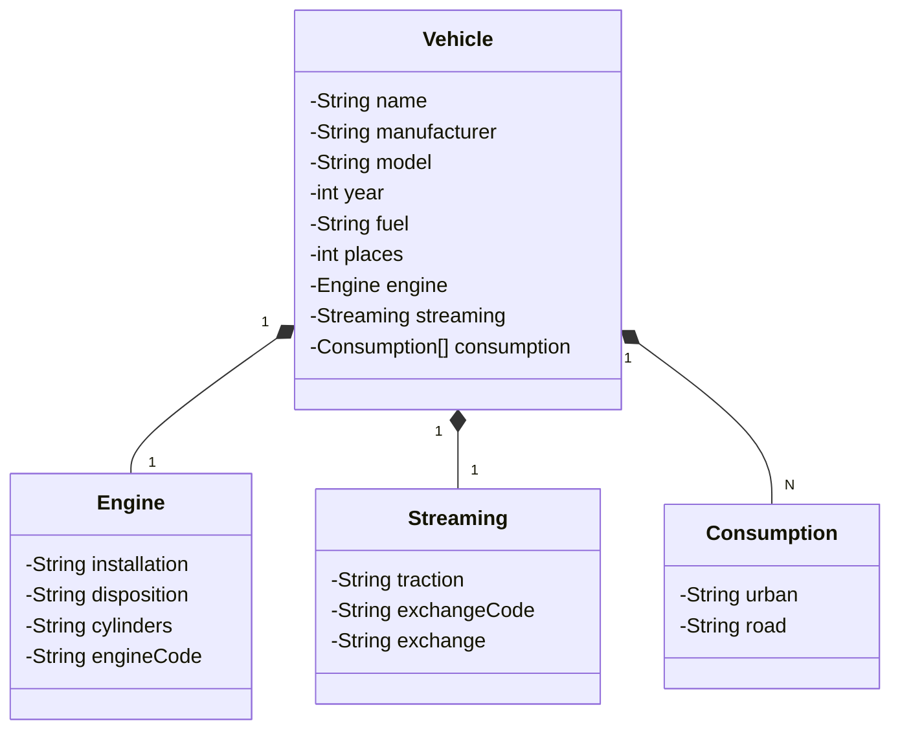

# Santander 2024 - Backend com java
Java RESTful criada para o bootcamp da santander

## Diagrama de classes

```mermaid 
classDiagram
    class Vehicle {
        -String name
        -String manufacturer
        -String model
        -int year
        -String fuel
        -int places
        -Engine engine
        -Streaming streaming
        -Consumption[] consumption
    }
    
    class Engine {
        -String installation
        -String disposition
        -String cylinders
        -String engineCode
    }
    
    class Streaming {
        -String traction
        -String exchangeCode
        -String exchange
    }
    
    class Consumption {
        -String urban
        -String road
    }
    
    Vehicle "1" *-- "1" Engine
    Vehicle "1" *-- "1" Streaming
    Vehicle "1" *-- "N" Consumption
```
