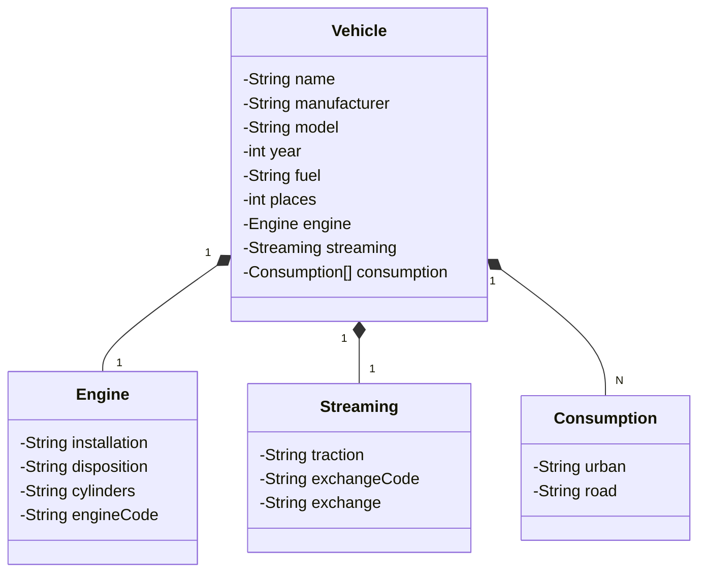

# Santander 2024 - Backend com java
Java RESTful criada para o bootcamp da santander

## Principais Tecnologias 
- **Java 17:** Utilizaremos a versão LTS mais recente do Java para aproveitar as últimas inovações que essa robusta e amplamente utilizada linguagem oferece;
- **Spring Boot 3:** Trabalharemos com a versão mais recente do Spring Boot, que maximiza a produtividade do desenvolvedor através de sua poderosa premissa de autoconfiguração;
- **Spring Data JPA:** Exploraremos como essa ferramenta pode simplificar nossa camada de acesso a dados, facilitando a integração com bancos de dados SQL;
- **OpenAPI (Swagger):** Vamos criar uma documentação de API eficaz e fácil de entender usando a OpenAPI (Swagger), perfeitamente alinhada com a alta produtividade que o Spring Boot oferece;
- **Railway:** facilita o deploy e monitoramento de nossas soluções na nuvem, além de oferecer diversos bancos de dados como serviço e pipelines de CI/CD.

## Diagrama de classes

## Documentação da API (Swagger)
- [Documentação Swagger](https://dio-api-rest-production.up.railway.app/swagger-ui/index.html#/)

Esta API estará disponível no Railway por um tempo limitado. No entanto, o código-fonte é aberto, então sinta-se livre para cloná-lo, modificá-lo e utilizá-lo como base para novos projetos. Execute-o localmente ou na plataforma de sua preferência!

## 🔍 Referências
- [Digital Innovation One](https://github.com/digitalinnovationone)
